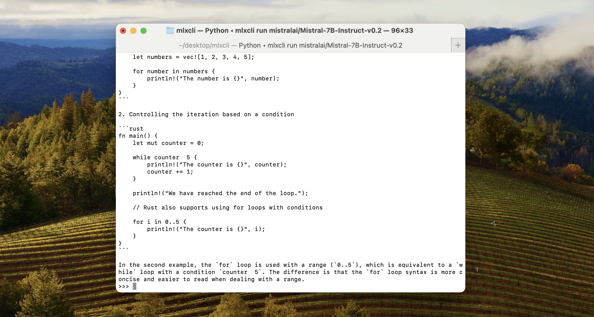

# mlxcli

Run large models locally through the terminal using [MLX](https://github.com/ml-explore/mlx).



**Features:**

- Run language models directly from the terminal.
- Optimized for Apple Silicon using MLX.
- Verbose output to measure the TPS & Time Elapsed.
- Chat with context of your previous messages in the terminal.

## Installation & Usage

Download using `pip`:

```bash copy
pip install mlxcli
```

Select the model you want to use, browse all models on Huggingface [mlx-community](https://huggingface.co/mlx-community) 🤗

```bash copy
mlxcli run mistralai/Mistral-7B-Instruct-v0.2
```

**Popular Models**:

- Mistral 7B Instruct: `mlxcli run mistralai/Mistral-7B-Instruct-v0.2`
- Nous Research Mistral 7B 4-bit quant: `mlxcli run mlx-community/Nous-Hermes-2-Mistral-7B-DPO-4bit-MLX`
- Hermes 2 Pro Mistral 7B 8-bit quant: `mlx-community/Hermes-2-Pro-Mistral-7B-8bit`

**Requirements**:

- Using an M series chip (Apple silicon)
- Using a native Python >= 3.8
- macOS >= 13.5

## Configuration

- **Verbose**: Include the tokens per second & time elapsed for each prompt using `/verbose`. You can also disable it by running the command again!

## Troubleshooting

To solve the following - `zsh: command not found: mlxcli` run:

1. Locate the path using `pip show mlxcli`
2. Open up zshrc using `vim ~/.zshrc`
3. Add the path path to zshrc `export PATH="{path_from_pip_show}:$PATH"`
4. Reload and apply changes: `source ~/.zshrc`

## Credits

This library was created by [Mustafa Aljadery](https://www.maxaljadery.com/) & [Siddharth Sharma](https://stanford.edu/~sidshr/). Contact Us for contribution!

This was creating using Huggingface [mlx_lm](https://huggingface.co/docs/hub/en/mlx), shoutout to 🤗, and Apple [MLX](https://github.com/ml-explore/mlx) shoutout to [Awni Hannun](https://twitter.com/awnihannun).
